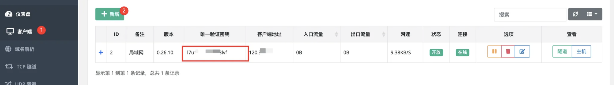
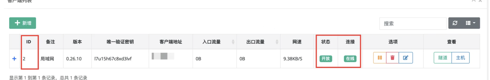
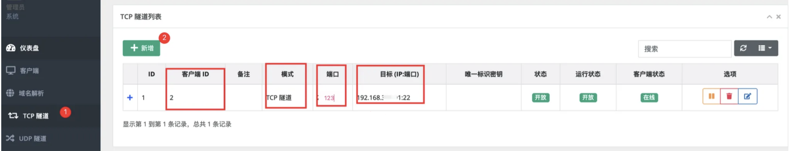

# NPS

https://github.com/ehang-io/nps/releases

## 服务端

```python
1. 根据系统架构下载安装包 uname -i

2. tar -zxvf linux_amd64_server.tar.gz # 解压
		./npc install  # 安装

3. vim /etc/nps/conf/nps.conf # 可选，修改配置

4. nps stop && nps start # 默认账号 admin/123

```


## 客户端

1. 登录面板后创建客户端密钥



```python
2. tar -zxvf linux_amd64_client.tar.gz # 解压
		./npc install # 安装
		
3. nohup npc -server=ip:port -vkey=[客户端唯一验证秘钥] &
```

4. 配置转发规则，确保客户端已连接



5. 添加tcp转发

如下配置表示将服务端的 123 端口 转发到 局域网内部 192.168.x.x的22端口。其他的UDP、SOCKS、HTTP也是类似的配置不再赘述。



## 测试连接

用SSH客户端 连接 `[服务器IP]:[123端口]` 即可实现访问 `[内网服务器]:[22端口]`